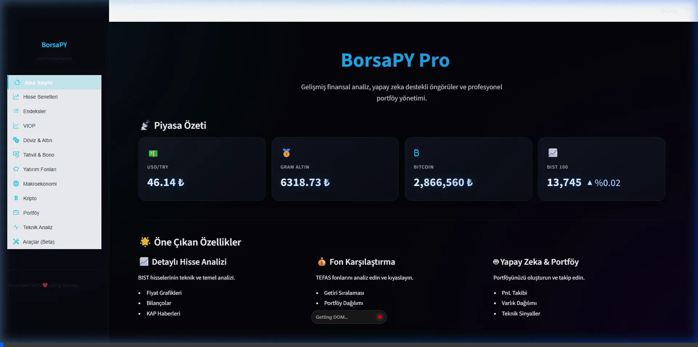

# BorsaPY Streamlit 🚀


**BorsaPY Pro**, Borsa İstanbul (BIST), Kripto Paralar, Döviz, Altın ve Yatırım Fonları için geliştirilmiş, yapay zeka destekli profesyonel bir finansal analiz ve portföy yönetimi panelidir.

### 🎥 Ekran Görüntüsü / Önizleme


## 🌟 Öne Çıkan Özellikler

### 🤖 Yapay Zeka Destekli Swarm Terminali
- **Akıllı Orkestratör:** Kullanıcı sorgusunu analiz ederek otomatik olarak ilgili uzman ajana (Hisse, Kripto, Fon, Makro, Varant) yönlendirir.
- **Hisse & Fon Tarayıcı Entegrasyonu:** Genel öneri sorgularında (`hisse öner`, `en iyi fonlar`) yapay zeka doğrudan toplu tarama algoritmalarını çalıştırır.
- **Kişiselleştirilmiş Profil:** Ajanlar, kullanıcı risk profiline (yaş, risk seviyesi, yatırım amacı) göre kararları ve güven skorlarını kişiselleştirir.

### 📊 Detaylı Piyasa Analizi
- **Hisse Senetleri:** BIST 100/30 şirketleri için teknik analiz, bilanço, gelir tablosu ve KAP haberleri.
- **Teknik Sinyaller:** RSI, MACD, SMA gibi indikatörlere dayalı otomatik AL/SAT sinyalleri.
- **ETF Sahipliği:** Hisselerin hangi global borsa yatırım fonlarında (ETF) yer aldığını görün.
- **Hisse Tarama (Screener):** Sektör ve endeks bazlı hisse filtreleme.

### 🌍 Küresel Makro & Duygu Göstergeleri (Yeni ⚡)
- **Küresel Endeksler & Risk İştahı:** S&P 500, Nasdaq, VIX Korku Endeksi, DXY Dolar Endeksi, DAX, FTSE ve Nikkei anlık fiyat ve günlük değişim takibi.
- **Kripto Fear & Greed Index:** Kripto piyasalarındaki duygu durumunu (Korku / Açgözlülük seviyeleri) Türkçe etiketlerle okuma ve analiz.
- **Brent Ham Petrol:** Petrol fiyatları ve 1A/3A performans analizleri ile global enflasyonist etkilerin yorumlanması.
- **Tahvil ve Eurobond Faizleri:** Türkiye 2Y, 5Y, 10Y yerel tahvil faizleri ile yüksek getirili Eurobond verilerinin getiri eğrisi (yield curve) analizi.

### 💰 Yatırım Fonları
- **TEFAS Analizi:** Tüm yatırım fonlarının detaylı analizi ve varlık dağılımları.
- **Karşılaştırma:** Birden fazla fonu getiri, risk ve portföy yapısına göre kıyaslayın.
- **Filtreleme:** En çok kazandıran fonları belirlediğiniz kriterlere göre listeleyin.

### 📈 Portföy Yönetimi
- **Varlık Takibi:** Hisse, Fon, Kripto ve Döviz varlıklarınızı tek bir yerden yönetin.
- **Risk Analizi:** Portföyünüzün Sharpe Oranı, Volatilitesi ve Beta değerini hesaplayın.
- **PnL Analizi:** Toplam kar/zarar durumunuzu anlık olarak izleyin.

## 🛠️ Kurulum

Bu projeyi yerel bilgisayarınızda çalıştırmak için:

1. **Depoyu klonlayın:**
   ```bash
   git clone https://github.com/rocoboz/borsapy-streamlit.git
   cd borsapy-streamlit
   ```

2. **Gerekli kütüphaneleri yükleyin:**
   ```bash
   pip install -r requirements.txt
   ```

3. **Uygulamayı başlatın:**
   ```bash
   streamlit run app.py
   ```

## 🌐 Yayına Alma (Deploy)

Bu proje **Streamlit Community Cloud** ile %100 uyumludur.
1. GitHub deponuza yükleyin.
2. [share.streamlit.io](https://share.streamlit.io) adresine gidin.
3. Deponuzu seçip "Deploy" butonuna basın.

## ⚠️ Yasal Uyarı
Bu uygulama yatırım tavsiyesi vermez. Sağlanan veriler bilgilendirme amaçlıdır. Yatırım kararlarınızı kendi araştırmanıza dayanarak vermelisiniz.

---
*Geliştirilmiş BorsaPY Pro Arayüzü v1.2*
